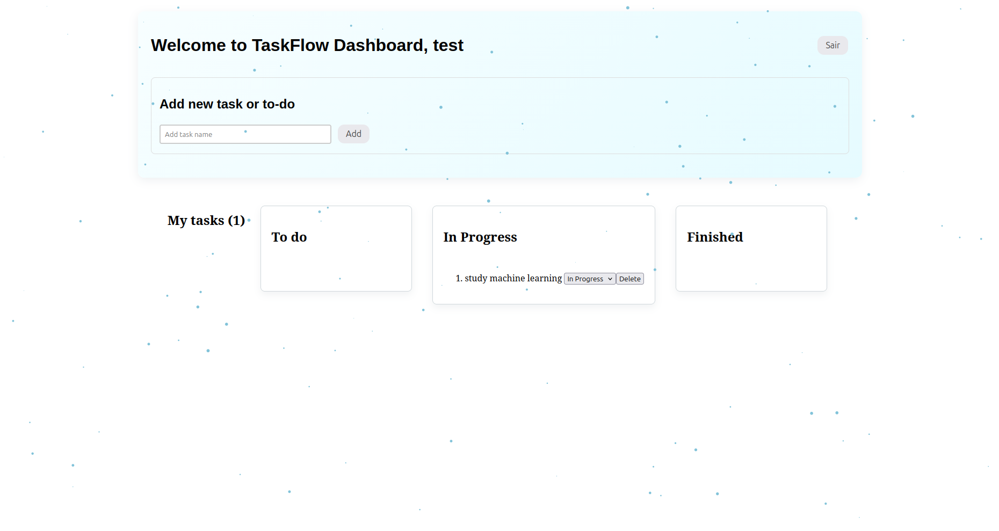

# TaskFlow Dashboard

A modern fullstack application for daily task management, organized in a Kanban style. This project allows users to register, log in, and manage their activities by dividing them into three main categories: To Do, In Progress, and Finished.

## Features

- **User Authentication:** Secure registration and login system.
- **Task Management:** Create, view, update, and delete tasks.
- **Kanban Board:** Visual organization of tasks across different status columns.
- **Modern Interface:** Built with React and Vite, including interactive notifications using react-hot-toast.
- **Local Database:** Uses SQLite (via the native Node.js sqlite module) for lightweight, fast, and simple storage without complex external server configuration.

## Technologies Used

**Frontend:**
- React (v19)
- Vite (Build tool and development server)
- React Hot Toast (Notification system)
- HTML5, CSS3, and JavaScript (ES6+)

**Backend:**
- Node.js (Runtime environment)
- Express.js (Web framework for the API)
- Node SQLite (Native module for database management)
- CORS (Middleware for cross-origin requests)

## Project Structure
```
TaskFlow-Dashboard/
├── backend/                # Server-side code (API)
│   ├── routes/             # API routes (authentication and tasks)
│   ├── db.js               # SQLite database configuration and initialization
│   ├── server.js           # Main entry point for the Express server
│   └── package.json        # Backend dependencies
├── frontend/               # Client-side user interface
│   ├── src/                # React components, pages, and state logic
│   ├── public/             # Public static assets
│   ├── index.html          # Base HTML file
│   ├── vite.config.js      # Vite configuration
│   └── package.json        # Frontend dependencies
└── README.md               # Project documentation
```

## Prerequisites

Before you begin, ensure you have the following installed on your machine:
- Node.js (version 22 or higher is recommended due to the use of the native node:sqlite module)
- npm, yarn, or pnpm

## How to Run the Project

**Follow the steps below to set up and run the development environment locally.**

1. Clone the repository:
```
git clone https://github.com/Luizrattacaso/TaskFlow-Dashboard.git
cd TaskFlow-Dashboard
```
## Quick Setup and Development

This project includes convenient npm scripts to simplify the setup and development process. All commands should be run from the root directory of the project.

### Initial Setup

For better and easy setup environment please install the `concurrently` with this command:

```
npm install concurrently --save-dev
```

To install all dependencies for the root, backend, and frontend folders at once, run:

```
npm run setup
```

## Running Services

If you need to run only one service, 

you can use for frontend:
```
npm run start:frontend
```

you can use for backend:
```
npm run start:backend
```

To start both the frontend and backend servers simultaneously in development mode, run in the `TaskFlow-Dashboard` folder:
```
npm run dev
```
## Quick Overview

### Application Demo
<video src="./frontend/public/assets/example.mp4" controls width="100%"></video>

### Christmas Theme
I also use this theme throughout December for the Christmas season:




